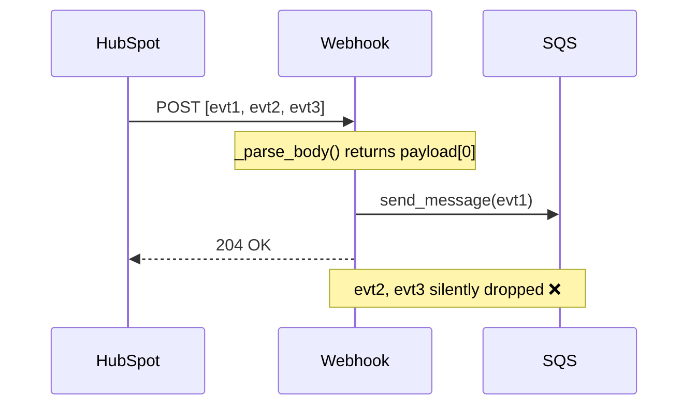
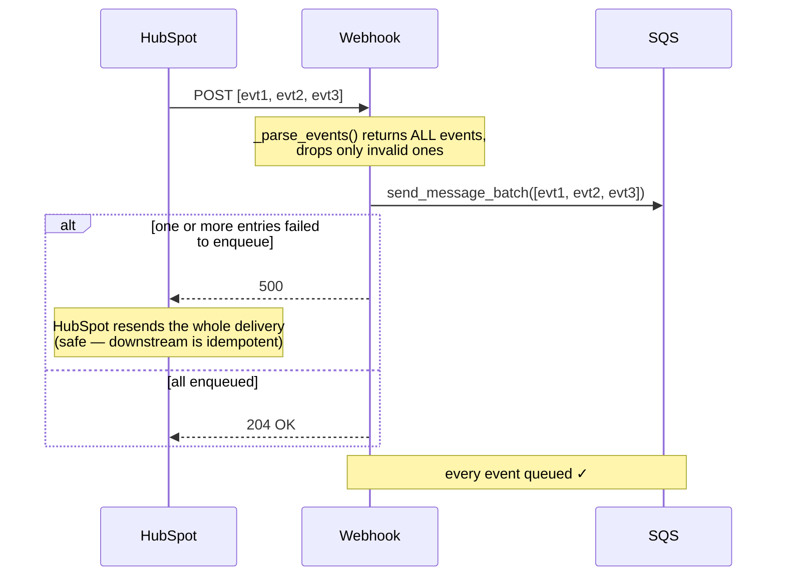

# 01 — Batched webhook truncated to the first event

**Register risk:** 2 — Lost events (High)
**Code:** [lambda_functions/hubspot_webhook/lambda_function.py](../../lambda_functions/hubspot_webhook/lambda_function.py)

## The situation

HubSpot delivers webhooks as a **JSON array** — a single POST can carry many events (e.g. a
user edits several line items at once, or HubSpot batches rapid property changes). The
webhook endpoint must enqueue *every* event in that array.

## Before — only the first event survives

The handler parsed the body and, for an array, returned `payload[0]`:

```python
if isinstance(payload, list) and payload:
    return payload[0]      # everything after index 0 is discarded
```



### How it failed
HubSpot received a `204` (success), so it never retried. `evt2` and `evt3` — and the NetSuite
work they represented — were **gone with no error and no trace**. A multi-line edit could sync
one line and silently lose the rest.

## After — every event is enqueued

`_parse_events` returns the whole array; the handler validates each event and publishes them
with `send_message_batch` (chunked at SQS's 10-per-call limit), one message per event.



### How it's prevented
- All events are parsed and enqueued — nothing is dropped.
- One SQS message per event means each gets its **own** retry / DLQ / lock / idempotency
  treatment downstream.
- A partial enqueue failure returns `500` so HubSpot resends; re-enqueuing the events that
  already made it is harmless because every downstream sync is idempotent on the object id
  (see [03](03-duplicate-invoice-concurrent-create.md)).

### Residual notes
The processor was already able to handle a list body, so this fix is purely on the inbound
side. Invalid events (missing `objectId`/`subscriptionType`) are logged and skipped without
failing the valid ones in the same batch.
