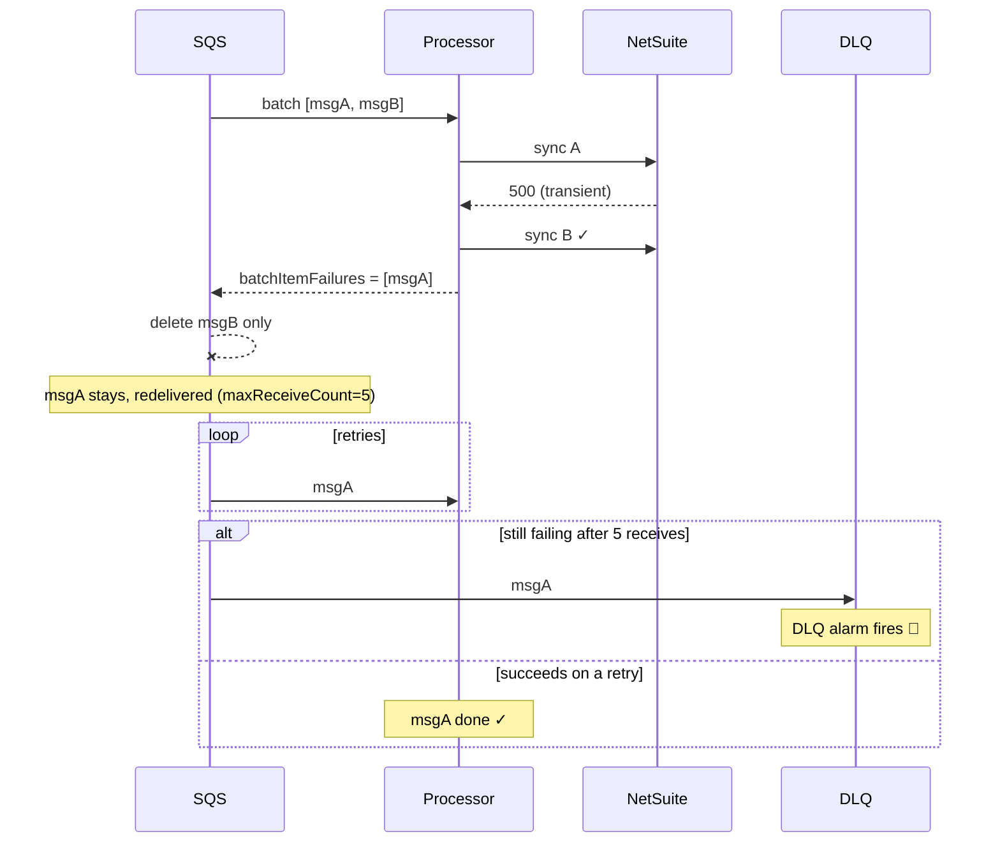

# 02 — Processing failures deleted, never retried

**Register risk:** 4 — DLQ retry (Medium)
**Code:** [lambda_functions/hubspot_processor/sqs_processor.py](../../lambda_functions/hubspot_processor/sqs_processor.py) · [template.yaml](../../template.yaml)

## The situation

A processor invocation handles a batch of SQS messages. Some may fail transiently (NetSuite
5xx, throttling, HubSpot timeout). Those messages must be **retried**, and after repeated
failures land in the **DLQ** for visibility — not be thrown away.

## Before — every batch reported success

The handler caught per-record errors, counted them, and **always returned HTTP 200**:

```python
except Exception:
    logger.exception("Failed record ...")
    failure_count += 1
# ...
return {"statusCode": 200, "body": ...}   # batch reported as fully successful
```

For an SQS event source, returning success tells SQS the **entire batch** was processed, so
SQS **deletes every message — including the failed ones.**

```mermaid
sequenceDiagram
    participant SQS
    participant Processor
    participant NetSuite
    participant DLQ
    SQS->>Processor: batch [msgA, msgB]
    Processor->>NetSuite: sync A
    NetSuite-->>Processor: 500 (transient)
    Note over Processor: caught, failure_count++
    Processor->>NetSuite: sync B ✓
    Processor-->>SQS: 200 (whole batch OK)
    SQS--xSQS: delete msgA AND msgB
    Note over SQS,DLQ: msgA never retried; DLQ stays empty ❌
```

### How it failed
A transient blip permanently lost `msgA`. The `RedrivePolicy`/DLQ existed in the template but
**could never receive anything**, because messages were always deleted as "successful." There
was no retry and no alarm — the failure was invisible.

## After — partial batch failures redrive and reach the DLQ

The handler returns the `ReportBatchItemFailures` response, listing only the failed message
ids; the event source declares it accepts that contract.

```python
# template.yaml — SQS event source
FunctionResponseTypes:
  - ReportBatchItemFailures

# sqs_processor.lambda_handler
return {"batchItemFailures": [{"itemIdentifier": mid} for mid in failed]}
```



### How it's prevented
- Only the **failed** message is retried; successful ones are acked normally.
- After `maxReceiveCount: 5`, the message moves to the **DLQ**, and
  `HubSpotWebhookDLQAlarm` fires so a human knows.
- **Three explicit outcomes, easy to see in code and logs:** a raised exception redrives
  (transient → DLQ if it persists); `False` is acked immediately but logged loudly as
  `[rejected] ...` and recorded on the deal via `netsuite_invoice_status` (permanent business
  rejection — retrying can't help); `True` is a clean ack (sync or intentional skip). Only
  transient errors reach the DLQ, so it stays signal, not noise.

### Residual notes
A message that keeps losing the per-deal lock is also reported as a failure and redriven; see
[08](08-worker-crash-stuck-lock.md) and the lock-contention discussion in
[../../RELIABILITY.md](../../RELIABILITY.md) for why this costs ~1 extra receive rather than a
false DLQ entry.
