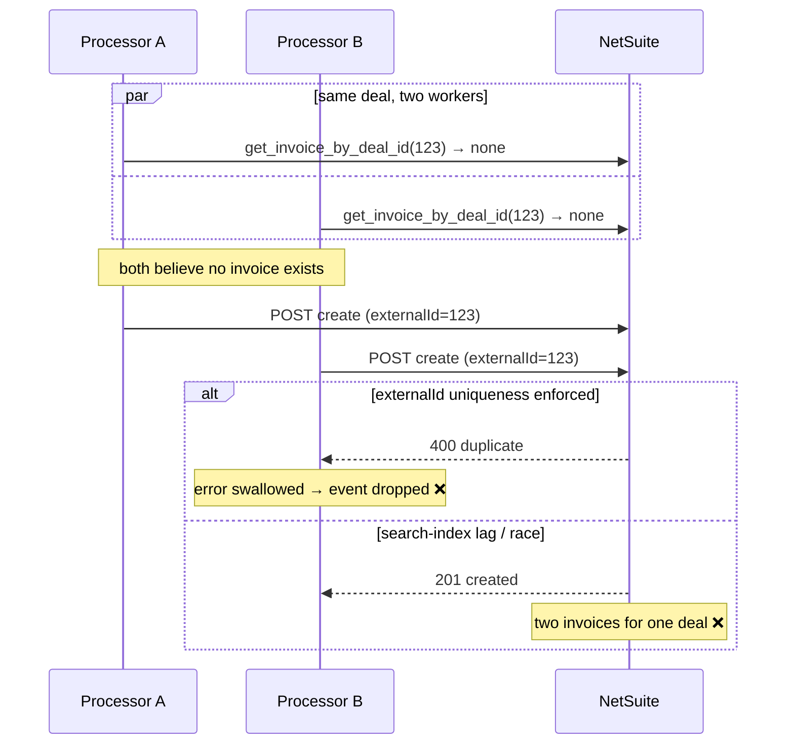
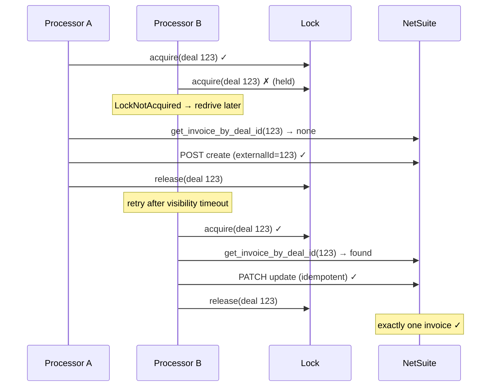

# 03 — Duplicate / dropped invoice creation

**Register risk:** 3 — Idempotency (Medium)
**Code:** [sqs_processor.py](../../lambda_functions/hubspot_processor/sqs_processor.py) · [netsuite_auth.py](../../lambda_functions/hubspot_processor/netsuite_auth.py) · [locks.py](../../lambda_functions/hubspot_processor/locks.py)

## The situation

Two events for the **same deal** are processed close together — e.g. HubSpot retries a
delivery, or SQS redelivers, or two property changes fire in quick succession. Both want to
create/sync the same invoice (`externalId = deal id`).

## Before — read-then-create with no serialization

Each invocation independently checked for an existing invoice and, finding none, POSTed a
create:

```python
netsuite_invoice_id = netsuite.get_invoice_by_deal_id(deal_id)   # → None
# ... seconds of other API calls ...
netsuite.create_or_update_invoice(invoice, netsuite_invoice_id)  # POST create
```



### How it failed
The only thing standing between two concurrent creates was NetSuite's `externalId`
uniqueness. When it held, the loser got a hard error that the old handler **swallowed and
dropped** (see [02](02-failures-silently-dropped.md)). When the read-after-write index lagged,
the guard `get_invoice_by_deal_id` returned `None` even though an invoice existed, and a
**second invoice** could be created. Either way the outcome was non-deterministic.

## After — per-deal lock + collision recovery

The processor acquires a DynamoDB lock keyed on the parent deal id **before** any NetSuite
work, so only one worker touches deal 123 at a time. And `create_or_update_invoice` recovers
from a duplicate-`externalId` POST by patching the existing invoice.



### How it's prevented
- **Mutual exclusion**: the lock guarantees the two events run sequentially, so B sees A's
  invoice and takes the **update** path instead of creating a second one.
- **Defense in depth**: even without the lock, `create_or_update_invoice` catches a failed
  create, re-resolves by `externalId`, and PATCHes — converting a race into a clean update
  instead of an error.

```python
try:
    response = self.make_request("POST", "record/v1/invoice", netsuite_invoice)
except requests.exceptions.HTTPError:
    existing_id = self.get_invoice_by_deal_id(ext) if ext else None
    if not existing_id:
        raise
    # someone created it first → patch instead of duplicating
    response = self.make_request("PATCH", f"record/v1/invoice/{existing_id}", ..., params={"replace": "item"})
```

- **Idempotent reconcile**: because the handler re-reads full state and keys on `externalId`,
  re-running B produces the same invoice, not a new one.

### Residual notes
The lock-loser's retry waits up to one SQS visibility cycle (see
[08](08-worker-crash-stuck-lock.md) and the contention note in
[../../RELIABILITY.md](../../RELIABILITY.md)). Correctness is unaffected — only latency.
