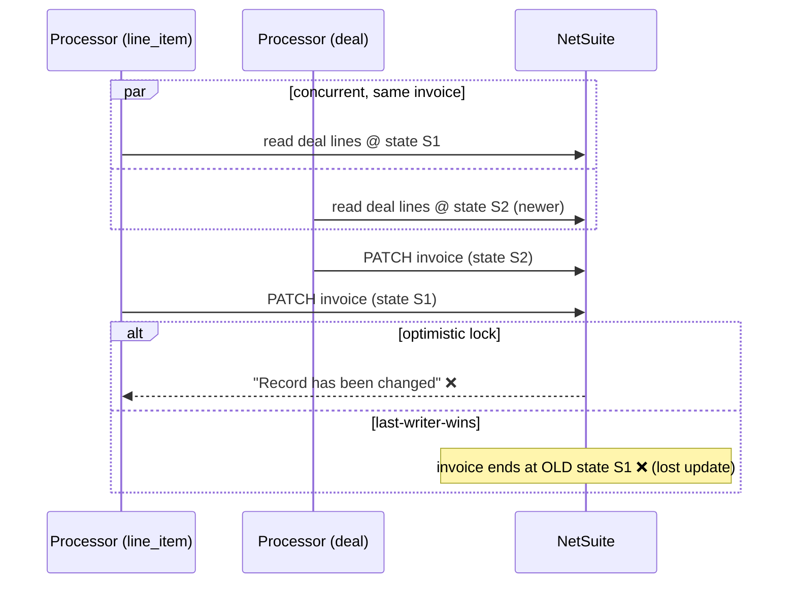
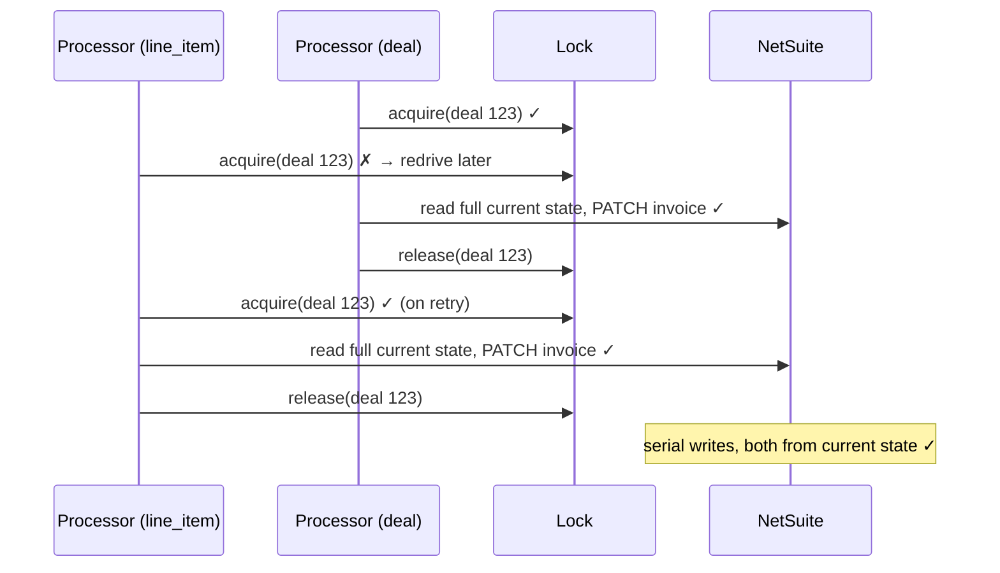

# 04 — Line-item + deal events race on one invoice

**Register risk:** parent/child consistency (raised in review)
**Code:** [sqs_processor.py](../../lambda_functions/hubspot_processor/sqs_processor.py) · [locks.py](../../lambda_functions/hubspot_processor/locks.py)

## The situation

A user changes a line item's quantity or price. HubSpot recalculates the deal `amount`, so it
fires **two** webhooks for the same invoice: a `line_item.propertyChange` *and* a
`deal.propertyChange`. These have **different `objectId`s** (the line item id vs. the deal
id), so they look unrelated — but both rebuild the same NetSuite invoice.

## Before — two writers, one invoice

The line-item handler PATCHed the invoice's lines while the deal handler upserted the whole
invoice — with nothing stopping them from running at the same time.

### How it failed
Two outcomes, both bad:
- **`Record has been changed`** — NetSuite's optimistic lock rejects the second PATCH (this
  error is in the README troubleshooting table), and under the old swallow-and-drop behavior
  that event was lost.
- **Lost update** — if the stale reader wrote last, the invoice ended up reflecting the
  *older* state, silently overwriting the newer one.

The root cause: grouping by the object's own id never serialized a line-item event against
its parent deal event.

## After — both events serialize on the parent deal

`_resolve_lock_key` maps **every** event to its parent deal id (line-item and payment events
resolve their parent via a cheap association lookup), so both take the *same* lock.

### How it's prevented
- **Same lock key** (`parent deal id`) → the two events are mutually exclusive; no concurrent
  PATCH, so no `Record has been changed`.
- **Reconcile-from-state** → whichever runs last re-reads the current HubSpot lines and writes
  them. Order doesn't matter; the invoice converges to the correct final state. No lost update.
- **No data collision even though the handlers differ**: the line-item handler only replaces
  the `item` sublist (`?replace=item`), the deal handler also writes deal-level fields; the
  overlapping part (lines) is computed from the same source, so serial execution is consistent.

### Residual notes
- A line-item event for a deal whose invoice does not exist yet is **skipped** (acked), not
  errored — the deal sync will pick up all current lines when it runs. No infinite retry.
- **Venue vs. deal** events lock on *different* keys (`venue:<id>` vs. the deal id) and can run
  concurrently; that is safe only because location upserts are idempotent on `externalId`.
