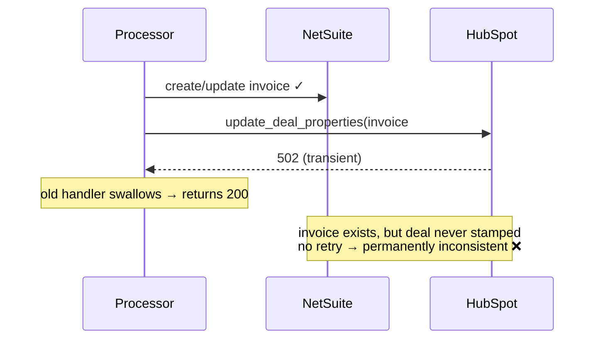

# 05 — NetSuite write succeeds, HubSpot writeback fails

**Register risk:** 6 — Integrity in NetSuite data changes (Low, depends on 3)
**Code:** [sqs_processor.py](../../lambda_functions/hubspot_processor/sqs_processor.py)

## The situation

Processing an invoice is multi-step: resolve venue/location → upsert the NetSuite invoice →
write `netsuite_invoice_number` / `netsuite_invoice_status` back to the HubSpot deal. What if
an API error hits **in the middle** — most importantly, the NetSuite invoice is created/updated
successfully but the **HubSpot writeback then fails**? NetSuite REST has no multi-record
transaction, so there is nothing to "roll back."

## Before — inconsistent state, no recovery

The upsert result was not checked, and any error was swallowed into a dropped event:

```python
netsuite.create_or_update_invoice(netsuite_invoice, netsuite_invoice_id)  # result ignored
time.sleep(1)
created_invoice_id = netsuite.get_invoice_by_deal_id(deal_id)
netsuite_invoice_number = netsuite.get_invoice_number(created_invoice_id)  # crashes if None
hubspot.update_deal_properties(deal_id, {...})   # if this throws → swallowed, no retry
```



### How it failed
The NetSuite invoice existed, but the HubSpot deal showed no invoice number/status, **forever**
— the event was acked and never retried. Worse, `get_invoice_number(None)` could itself throw
if the read-after-write lagged, masking the real state.

## After — confirm, then retry idempotently

The upsert result is checked and the invoice re-resolved **before** stamping the deal; any
failure (including the writeback) **raises**, so the message redrives and the whole reconcile
re-runs. Because every step is idempotent, the retry converges.

```python
if not netsuite.create_or_update_invoice(netsuite_invoice, netsuite_invoice_id):
    raise RuntimeError(...)                       # don't stamp success on a failed upsert
created_invoice_id = netsuite.get_invoice_by_deal_id(deal_id)
if not created_invoice_id:
    raise RuntimeError(...)                       # read-after-write lag → retry
netsuite_invoice_number = netsuite.get_invoice_number(created_invoice_id)
hubspot.update_deal_properties(deal_id, {...})    # raises on failure → redrive
```

```mermaid
sequenceDiagram
    participant SQS
    participant Processor
    participant NetSuite
    participant HubSpot
    SQS->>Processor: deal event (attempt 1)
    Processor->>NetSuite: create/update invoice ✓ (externalId=deal)
    Processor->>HubSpot: update_deal_properties(...)
    HubSpot-->>Processor: 502 (transient)
    Processor-->>SQS: batchItemFailure → redrive
    Note over Processor: lock released; NO duplicate created
    SQS->>Processor: deal event (attempt 2)
    Processor->>NetSuite: get_invoice_by_deal_id → found → PATCH (idempotent) ✓
    Processor->>HubSpot: update_deal_properties(...) ✓
    Note over NetSuite,HubSpot: NetSuite + HubSpot consistent ✓
```

### How it's prevented (the "overpass")
- **No rollback needed — idempotent re-run instead.** The invoice upsert is the last NetSuite
  commit, keyed on `externalId`; earlier steps (venue/location) are also idempotent on
  `externalId`. Re-running converges rather than duplicating.
- **The writeback is re-attempted on every retry.** A single `update_deal_properties` PATCH
  writes all three properties atomically, so there is no partial property state; the recomputed
  status is stable across attempts.
- **Backstop:** if HubSpot is down past 5 attempts, the message hits the DLQ + alarm.
  Redriving it once HubSpot recovers safely completes the writeback (reconcile is idempotent).

### The same guarantee for payments and venues
- **Payments** (`process_payment`): the upsert result is checked and "payment not found after
  upsert" is treated as **retryable** (read-after-write lag), not acked as permanent.
- **Venues** (`process_venue`): the NetSuite-id back-reference write to HubSpot now **raises**
  on failure (previously it was logged and swallowed), so it redrives like the invoice
  writeback. Re-running is safe — the location upsert is idempotent on `externalId`.

### Residual notes
There is a brief eventual-consistency window between the successful NetSuite write and a
successful writeback during which the HubSpot deal looks stale. It closes on the next retry;
it is a visibility lag, not data loss or duplication.
