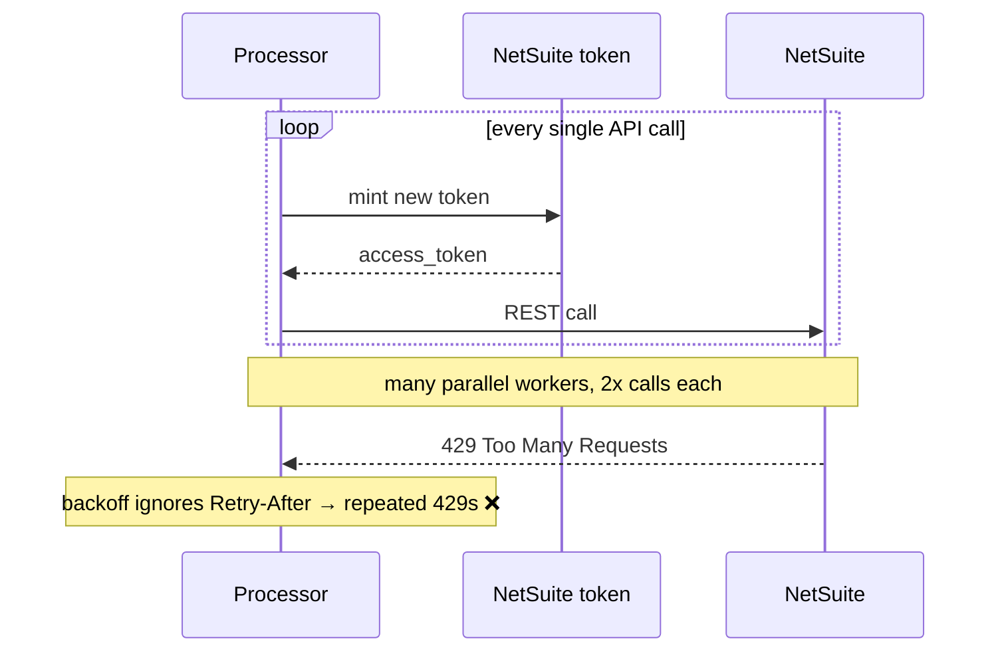
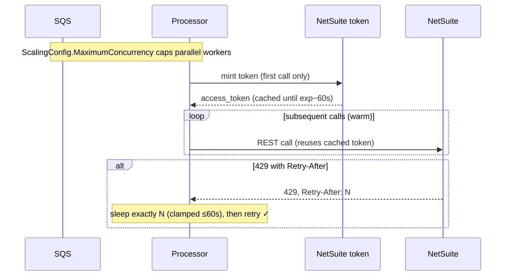

# 06 — NetSuite rate-limit / token exhaustion

**Register risk:** 4 — Shared NetSuite rate/concurrency budget (Medium)
**Code:** [netsuite_auth.py](../../lambda_functions/hubspot_processor/netsuite_auth.py) · [template.yaml](../../template.yaml)

## The situation

All client accounts share NetSuite's per-account concurrency and rate budget. Under a burst of
webhooks, the integration can hammer NetSuite — both the **token endpoint** (a fresh OAuth
token per call) and the **REST API** (many parallel Lambdas) — and start getting throttled.

## Before — a token per request, no Retry-After, unbounded fan-out

```python
def make_request(self, ...):
    access_token = self.get_access_token()   # mints a JWT + token call EVERY request
    ...
    if response.status_code == 429:
        sleep_time = retry_delay * (2 ** (attempt - 1))   # ignores Retry-After
```
…and the SQS event source had **no concurrency cap**, so a spike fanned out to many
simultaneous processor invocations.



### How it failed
- **Token endpoint pressure + latency**: minting a JWT and calling the token endpoint on every
  request doubled the call volume and slowed every operation.
- **Throttling storms**: ignoring `Retry-After` meant retrying too soon and re-triggering 429s.
- **No backpressure**: unbounded concurrency let a burst exceed the shared NetSuite budget,
  affecting *all* accounts.

## After — cached token, Retry-After, capped concurrency



### How it's prevented
- **Token caching** — `get_access_token` caches the token on the (module-level, warm-reused)
  `NetSuiteAuth` instance until ~60s before expiry. Roughly halves NetSuite traffic and cuts
  latency.
- **Honor `Retry-After`** — `_parse_retry_after` reads the header (numeric seconds, clamped to
  ≤60s; HTTP-date falls back to exponential backoff), so retries wait exactly as long as
  NetSuite asks.
- **Concurrency cap** — `ProcessorMaxConcurrency` (default 2) wired to
  `ScalingConfig.MaximumConcurrency` limits how many processor Lambdas hit NetSuite at once,
  keeping the integration inside the shared budget.
- **Tunable padding** — `API_CALL_DELAY_SECONDS` controls the inter-call delay (set `0` to
  disable now that real backpressure exists).

### Residual notes
The `time.sleep(1)` calls after invoice/payment writes are **read-after-write consistency
waits** (NetSuite's `externalId` search is eventually consistent), not rate-limit padding —
they are intentionally retained. Capping concurrency at 2 also interacts with the per-deal
lock; see the contention note in [../../RELIABILITY.md](../../RELIABILITY.md).
