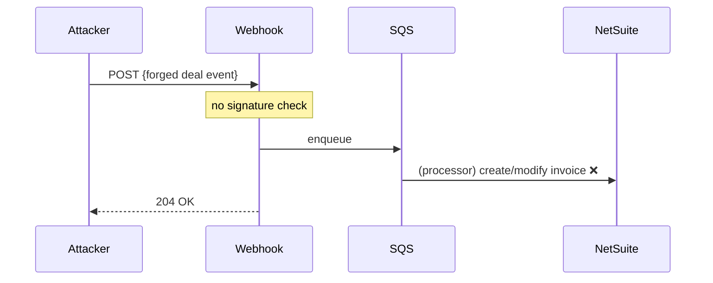
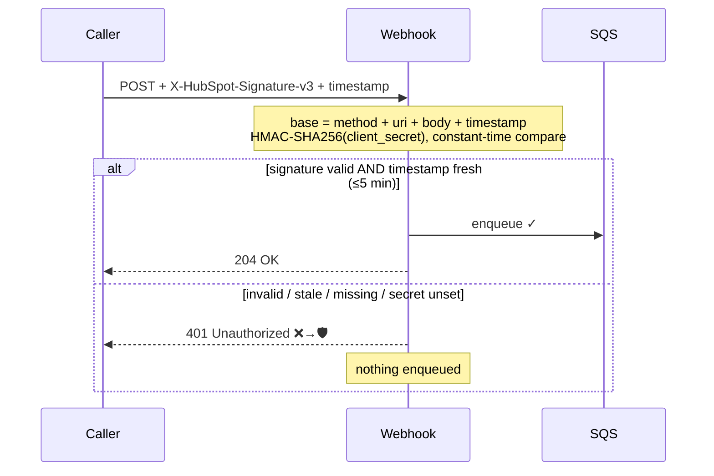

# 07 — Forged / unauthorized webhook

**Register risk:** 5 — HubSpot webhook signature verification (Low)
**Code:** [lambda_functions/hubspot_webhook/lambda_function.py](../../lambda_functions/hubspot_webhook/lambda_function.py) · [template.yaml](../../template.yaml)

## The situation

The webhook endpoint is a public HTTPS URL. Anyone who learns it can POST arbitrary payloads.
Without verifying that a request genuinely came from HubSpot, an attacker (or a misconfigured
system) could enqueue events that create or mutate NetSuite invoices, payments, and venues.

## Before — no verification

The handler accepted any well-formed POST and enqueued it.

### How it failed
A forged request was indistinguishable from a real one. The integration would happily sync
attacker-controlled data into NetSuite.

## After — HubSpot v3 signature verification (feature-flagged)

When enabled, the handler validates the **HubSpot v3** signature before doing anything else.

### How it's prevented
- **Authenticity**: `_verify_signature` recomputes the HMAC over
  `method + requestUri + body + timestamp` with the app **client secret** and compares in
  constant time (`hmac.compare_digest`). A forged request can't produce a valid signature.
- **Replay protection**: requests with a timestamp older than 5 minutes are rejected.
- **Fail-closed**: if verification is enabled but the secret is missing, requests are
  rejected — never silently allowed.

### Default OFF, by design
- `HubSpotSignatureVerificationEnabled` defaults to `"false"`, so the integration keeps working
  unchanged until the secret is provisioned.
- `HUBSPOT_CLIENT_SECRET` is resolved from Secrets Manager **only when the flag is on**
  (CloudFormation `Conditions` + `!If … AWS::NoValue`), so deploys succeed *before* the
  `hubspot_client_secret` key exists.

### To enable (per account)
1. Add `hubspot_client_secret` to the account's Secrets Manager secret.
2. Deploy with `HubSpotSignatureVerificationEnabled=true`.
3. Confirm a real webhook still returns `204` and a forged one returns `401`.
