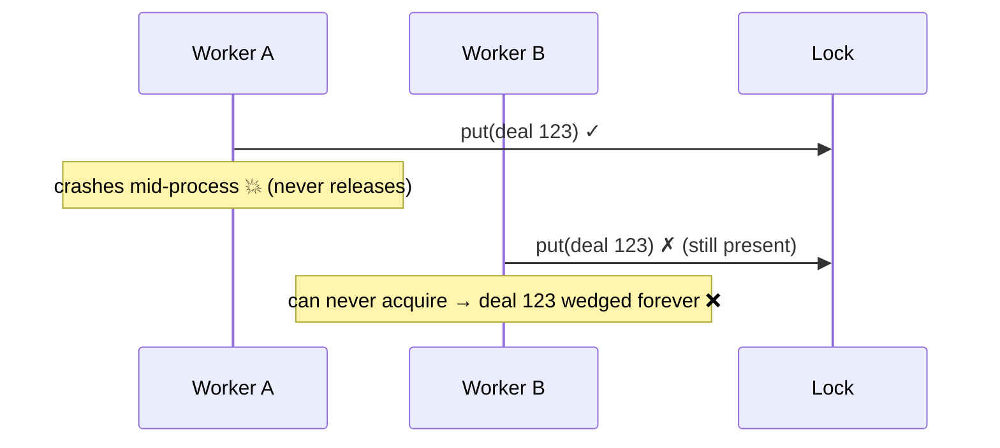
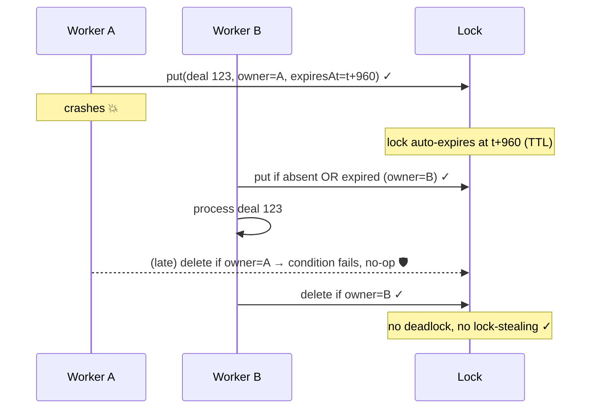

# 08 — Worker crashes holding the lock

**Register risk:** lock design (supports risks 3 & parent/child)
**Code:** [locks.py](../../lambda_functions/hubspot_processor/locks.py)

## The situation

The per-deal lock ([03](03-duplicate-invoice-concurrent-create.md),
[04](04-parent-child-write-race.md)) introduces a new failure mode of its own: what if a
worker acquires the lock and then **dies** (Lambda timeout, OOM, crash) before releasing it?
A naive lock would leave that deal **permanently blocked** — every future event for it would
fail to acquire and eventually DLQ. A second hazard is **lock-stealing**: after a lock
expires, a late-returning original owner must not delete a lock a *new* owner now holds.

This scenario compares a **naive lock** with the lock actually implemented.

## Before — a naive lock (illustrative)



A plain "put if absent / delete on finish" lock deadlocks the deal when the holder dies, and a
plain "delete on finish" lets a stale owner stomp a newer lock.

## After — TTL + fencing token

The implemented lock stores an `expiresAt` (TTL) and a per-acquisition `owner` token. Acquire
succeeds if the row is absent **or expired**; release only deletes if the `owner` still matches.

```python
# acquire: free OR expired
ConditionExpression="attribute_not_exists(deal_id) OR expiresAt < :now"
Item={"deal_id": key, "owner": token, "expiresAt": now + LOCK_TTL_SECONDS}

# release: only if we still own it
ConditionExpression="owner = :token"
```



### How it's prevented
- **No deadlock**: the TTL (`LOCK_TTL_SECONDS`, default 960s ≥ the SQS visibility timeout)
  guarantees a crashed worker's lock becomes acquirable again. The contending message is
  redriven anyway, so it simply succeeds on a later attempt.
- **No lock-stealing**: the conditional delete keyed on the `owner` token means a
  late-returning Worker A can only ever delete *its own* lock, never the one Worker B now
  holds. (This exact case is covered by a local test.)
- **Graceful degradation**: if `SYNC_LOCK_TABLE` is unset (e.g. local runs), the lock becomes
  a no-op so code still runs — see the note in [README](README.md) about making this fail
  loud in production if desired.

### Residual notes
TTL alignment matters: the lock TTL is set ≥ the queue visibility timeout so a held lock can't
outlive the window in which its message would be redelivered. The lock-contention latency
trade-off is described in [../../RELIABILITY.md](../../RELIABILITY.md).
