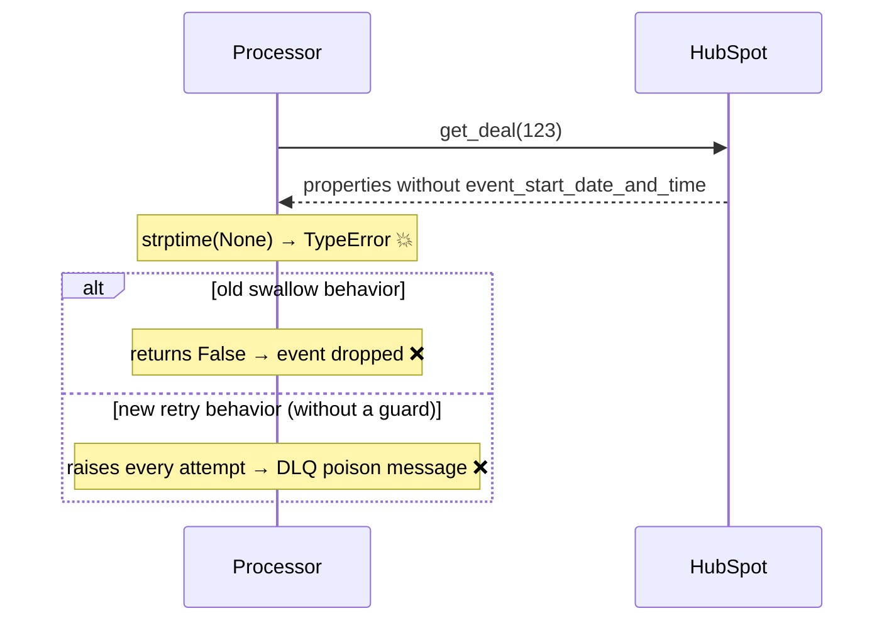

# 09 — Malformed data poisons a message

**Register risk:** 6 / general hardening
**Code:** [hubspot.py](../../lambda_functions/hubspot_processor/hubspot.py) · [lambda_function.py](../../lambda_functions/hubspot_webhook/lambda_function.py)

## The situation

Real CRM data is messy. A deal might be missing `event_start_date_and_time`, or hold a
malformed value. With the new **retry-on-exception** semantics (see
[02](02-failures-silently-dropped.md)), an unhandled crash on bad-but-permanent data is
especially nasty: it can't succeed on retry, so it would loop until it hits the DLQ — a
"poison message."

## Before — an unguarded parse crashes the sync

```python
event_start = datetime.strptime(properties.get('event_start_date_and_time'), '%Y-%m-%dT%H:%M:%SZ')
```

If the property is `None` or malformed, `strptime` raises `TypeError`/`ValueError`.



### How it failed
A single deal with a missing/blank event date would crash the whole reconcile. Under the old
swallow, it was silently dropped; under the new retry semantics it would burn all retries and
land in the DLQ — even though the deal is otherwise perfectly syncable.

## After — guarded parse, graceful degradation

The parse is wrapped: a missing/malformed date is logged and `tranDate` is simply **omitted**
(NetSuite defaults to the current date), so the rest of the deal syncs normally.

```python
raw_event_start = properties.get('event_start_date_and_time')
event_start_str = None
if raw_event_start:
    try:
        event_start = datetime.strptime(raw_event_start, '%Y-%m-%dT%H:%M:%SZ')
        event_start_str = event_start.replace(tzinfo=timezone.utc).strftime('%Y-%m-%d')
    except (TypeError, ValueError):
        logger.warning("Invalid event_start_date_and_time=%r on deal %s; omitting tranDate", ...)
# later: only set tranDate when we have a valid value
if event_start_str:
    netsuite_invoice['tranDate'] = event_start_str
```

```mermaid
sequenceDiagram
    participant Processor
    participant HubSpot
    participant NetSuite
    Processor->>HubSpot: get_deal(123)
    HubSpot-->>Processor: no / bad event_start_date_and_time
    Note over Processor: guarded parse → log + omit tranDate
    Processor->>NetSuite: upsert invoice (tranDate defaulted) ✓
    Note over Processor,NetSuite: deal syncs; no crash, no DLQ ✓
```

### How it's prevented
- **Bad input no longer crashes the sync** — it degrades to a sensible default and logs a
  warning, so a permanent data quirk doesn't churn retries or poison the DLQ.
- This pairs with the retryable-vs-permanent split: only genuinely *transient* errors should
  reach the DLQ; permanent data issues are handled inline.

## Related hardening: fail loud on misconfiguration

The opposite anti-pattern — *silently doing the wrong thing on bad config* — was also removed.
The webhook previously fell back to a placeholder `SQS_QUEUE_URL`:

```python
# before: a misconfigured deploy silently published to a fake queue
SQS_QUEUE_URL = os.environ.get("SQS_QUEUE_URL", "https://sqs.../YOUR_ACCOUNT_ID/YOUR_QUEUE_NAME")
```

Now the placeholder is gone and the handler returns `500` if the queue URL is unset, so a
misconfiguration fails visibly instead of dropping events into the void.

### Residual notes
Other "null-ish" property reads in the mapping (quantity, amount, price, guest count, etc.)
already coerce with `or 0` / guarded `float(...)`, so they don't crash on blanks. The
`event_start_date_and_time` parse was the one hard crash on missing data.
